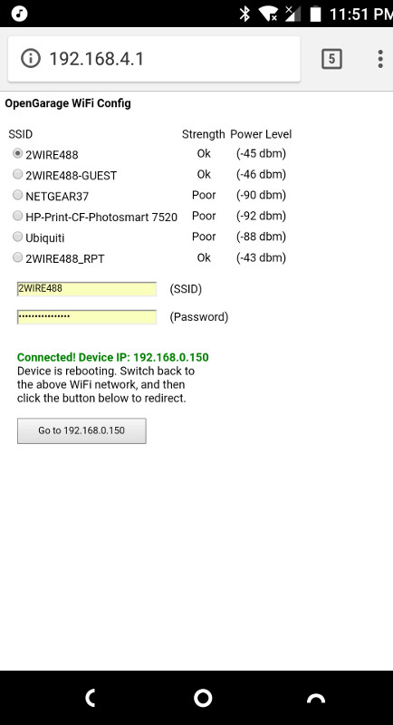
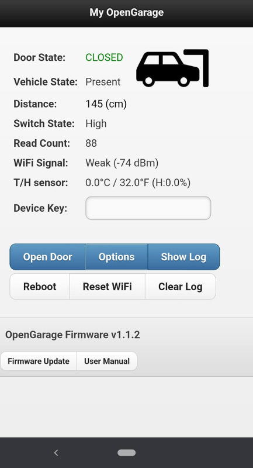
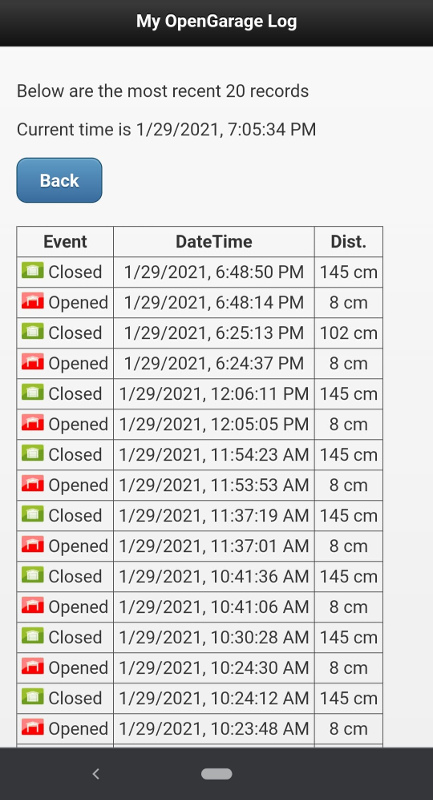
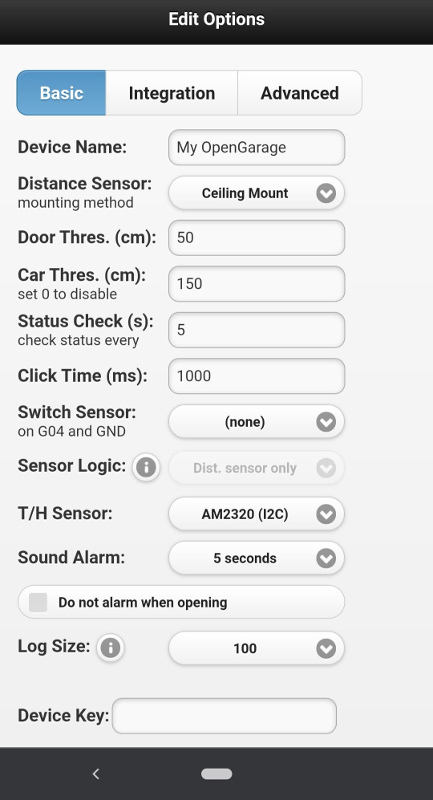
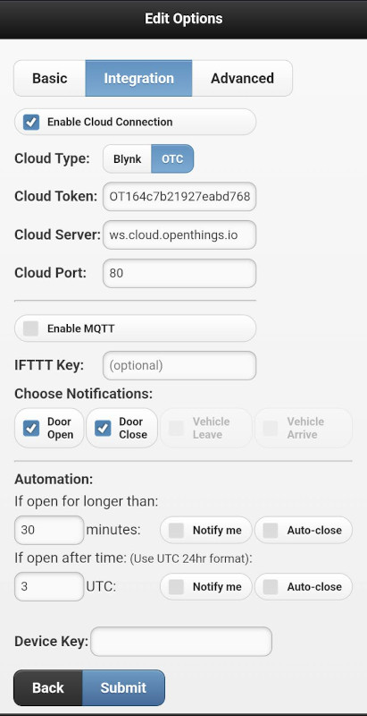
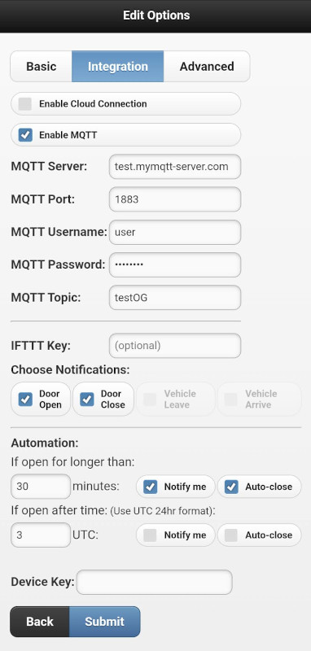
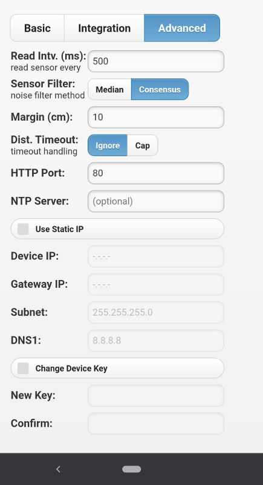
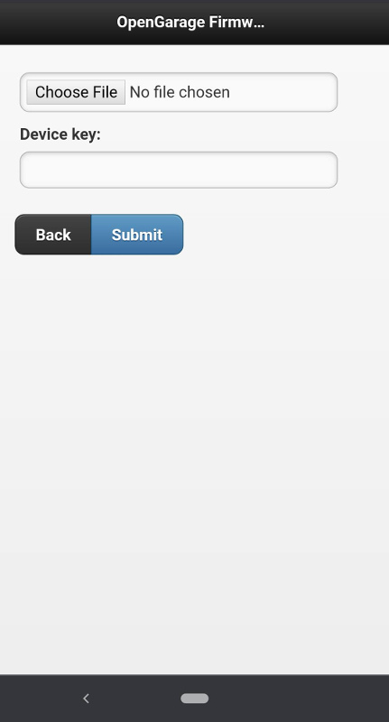

This folder contains firmware source code and documentation for OpenGarage. For proudct details, visit [http://opengarage.io](http://opengarage.io)

For Firmware release notes, go to [https://github.com/OpenGarage/OpenGarage-Firmware/releases](https://github.com/OpenGarage/OpenGarage-Firmware/releases)

      

### Firmware Compilation Instructions:

Check README.md in the `OpenGarage` folder.

#### Updating Firmware

As OpenGarage firmware supports OTA (over-the-air) update, you can upload the firmware through the web interface. At the homepage, find the **Update** or **Update Firmware** button and follow that to upload a new firmware. If your OpenGarage is in AP mode and not connected to any WiFi network yet, you can open `http://192.168.4.1/update` and that's the same interface.

#### Firmware User Manual and API

Go to the `doc` folder to find the user manual as well as the API document for each firmware version.

